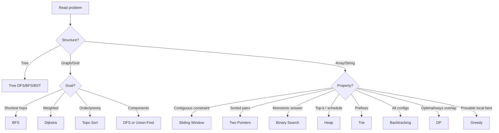
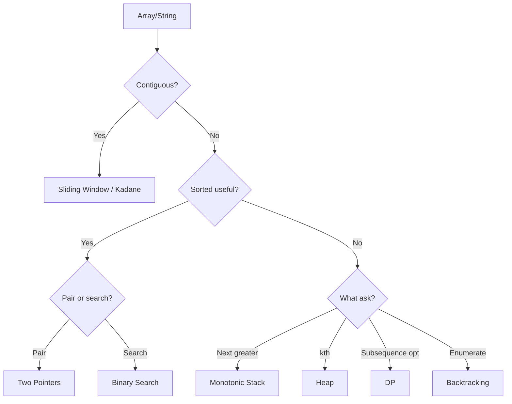
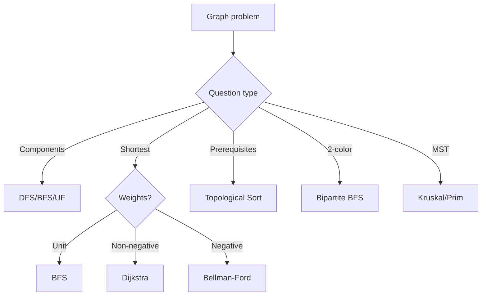
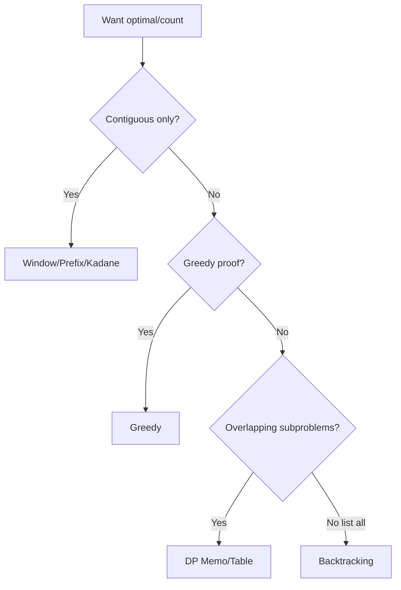

# Algorithm Decision Trees

> Interview-time choice maps. Start at the top. Speak the branch you take.

---

## 1. Ultra-Fast Master Tree (ASCII)

```text
READ PROBLEM
│
├─ Input is TREE?
│   └─ → Tree DFS/BFS / BST inorder / LCA / diameter templates
│
├─ Input is GRAPH / GRID / DEPENDENCIES?
│   ├─ Shortest unweighted → BFS
│   ├─ Shortest weighted ≥0 → Dijkstra
│   ├─ Prerequisites order → Topo
│   ├─ Components / merges → DFS/UF
│   └─ Cycle? undirected UF/DFS | directed colors/Kahn
│
├─ Contiguous segment + constraint?
│   └─ → Sliding Window (fixed / variable / count)
│
├─ Sorted (or sort OK) + pairs / ends?
│   └─ → Two Pointers
│
├─ Find value / first true / min feasible X?
│   └─ → Binary Search (array or answer space)
│
├─ Top-k / merge streams / next-best event?
│   └─ → Heap
│
├─ Prefix dictionary / many words?
│   └─ → Trie
│
├─ Generate all configs / place under rules?
│   └─ → Backtracking
│
├─ Optimal / ways with overlapping subproblems?
│   └─ → DP
│
└─ Local choice with proof?
    └─ → Greedy (else verify with DP/counterexample)
```

---

## 2. Mermaid — Master Chooser



---

## 3. Array / String Decision Tree

```text
ARRAY / STRING
├─ Need contiguous answer?
│  ├─ Fixed length k → Fixed Window / Deque max
│  ├─ Longest valid → Expand R, shrink while invalid
│  ├─ Shortest valid → Expand to valid, shrink while valid
│  ├─ Count subarrays → atMost / prefix+hash / ans+=R-L+1
│  └─ Max subarray sum → Kadane (DP special)
│
├─ Sorted or can sort?
│  ├─ Two Sum style → Opposite pointers / hash if unsorted
│  ├─ 3Sum → Sort + fix + two pointers
│  └─ Search target / bound → Binary Search
│
├─ Next greater / smaller → Monotonic Stack
├─ Stream / kth → Heap or Quickselect
├─ Subsequence optimal → DP (LIS/LCS)
└─ Generate subsets/perms → Backtracking
```



---

## 4. Graph Decision Tree

```text
GRAPH
├─ Model first: nodes? edges? directed? weights?
├─ Connectivity / islands / groups → DFS / BFS / UF
├─ Shortest
│  ├─ All weights 1 → BFS
│  ├─ Weights 0/1 → Deque 0-1 BFS
│  ├─ Weights ≥ 0 → Dijkstra
│  ├─ Negative OK, no neg cycle → Bellman-Ford
│  └─ Extra state (keys/mask) → BFS/Dijkstra on state graph
├─ Ordering with directed edges → Topo; leftover = cycle
├─ Bipartite → 2-color BFS
└─ MST → Kruskal (UF) / Prim (heap)
```



---

## 5. DP vs Greedy vs Window (Danger Zone)

```text
OPTIMIZATION PROBLEM
├─ Contiguous constraint only → WINDOW / PREFIX (not full DP)
├─ Can prove local choice optimal → GREEDY
├─ Need count/ways or overlapping choices → DP
└─ Unsure → write brute recursion
    ├─ Overlap + optimal substructure → memo = DP
    └─ Must list configurations → backtracking
```



---

## 6. Binary Search vs Two Pointers

```text
SORTED ARRAY
├─ Looking for index / bound / peak / rotated → BINARY SEARCH
├─ Pair from ends / container / 3Sum inner → TWO POINTERS
└─ Feasibility on value X over array → BS ON ANSWER + scan
```

---

## 7. Heap vs Sort vs Quickselect

```text
NEED ORDER STATISTICS / BEST ITEMS
├─ Full order needed → Sort O(n log n)
├─ Only kth / top-k → Heap O(n log k) or Quickselect avg O(n)
├─ Streaming forever → Heap (can't full sort each time)
└─ Merge k sorted → Heap
```

---

## 8. Tree Decision Tree

```text
TREE
├─ Level / view → BFS
├─ Height / diameter / max path / balanced → Postorder
├─ Root-to-leaf paths → DFS + path
├─ BST validate → Bounds
├─ BST kth / range → Inorder
├─ LCA → recurse both sides
└─ Rebuild → divide & conquer
```

---

## 9. Interview Minute Map (What to Draw)

In the first **1–2 minutes**, draw only this:

```text
Goal: _______________
Structure: _______________
Brute: _______________ O(___)
Key property: _______________
Pattern: _______________
Optimize to: _______________ O(___)
```

Then pick the matching tree branch from this file.

---

## 10. Company-Agnostic Priority Order (When Stuck)

1. Clarify constraints (n size → which complexity OK).  
2. Brute force correctly.  
3. Ask: contiguous? sorted? graph? monotonic? overlapping?  
4. Apply one pattern deeply — don't hop randomly.  
5. Test edge cases.

---

## 11. Negative Space — What Each Pattern Is NOT

| Pattern | Not for |
|---|---|
| BFS | Weighted shortest (generally) |
| Sliding Window | Non-contiguous subsequence |
| Two Pointers | Unsorted pair-sum without hash/sort |
| Greedy | Unproven coin systems / many DP tasks |
| DP | Simple connectivity / pure window |
| Binary Search | Non-monotonic predicates |
| Heap | When full sort + one pass is clearer and n small |

---

## Revision Checklist

- [ ] I can walk the master ASCII tree aloud  
- [ ] I can separate Window vs DP vs Greedy  
- [ ] I can choose BFS vs Dijkstra  
- [ ] I fill the 1–2 minute map every mock  

**Use with:** `pattern-recognition-guide.md` + each `*-patterns.md` file.
